    # Tutterfly CRM - API Flow Diagrams

## 🔄 Complete Request Flow

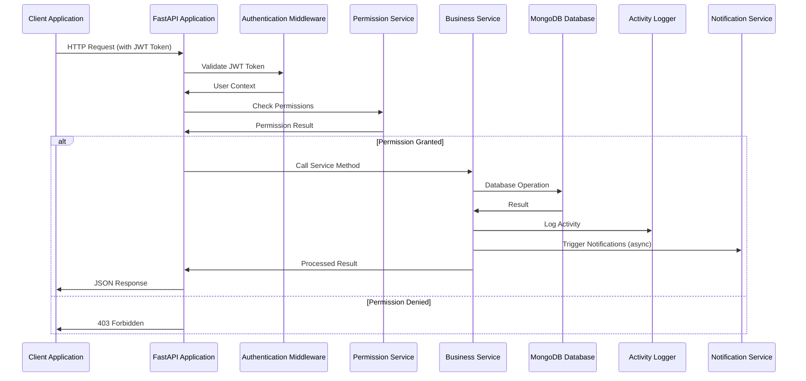

## 🏗️ Authentication Flow

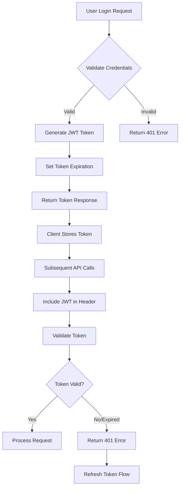

## 🏢 Multi-Tenant Data Flow

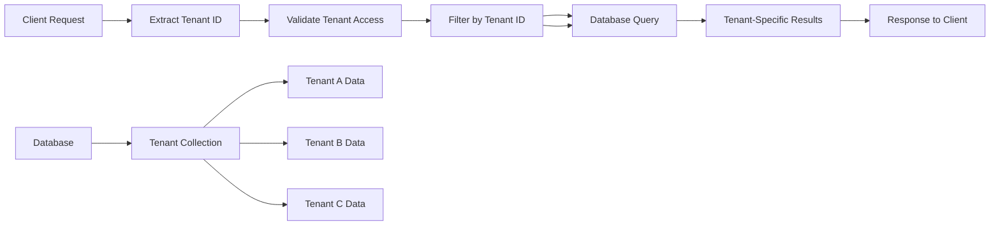

## 📊 CRM Entity Relationship Flow

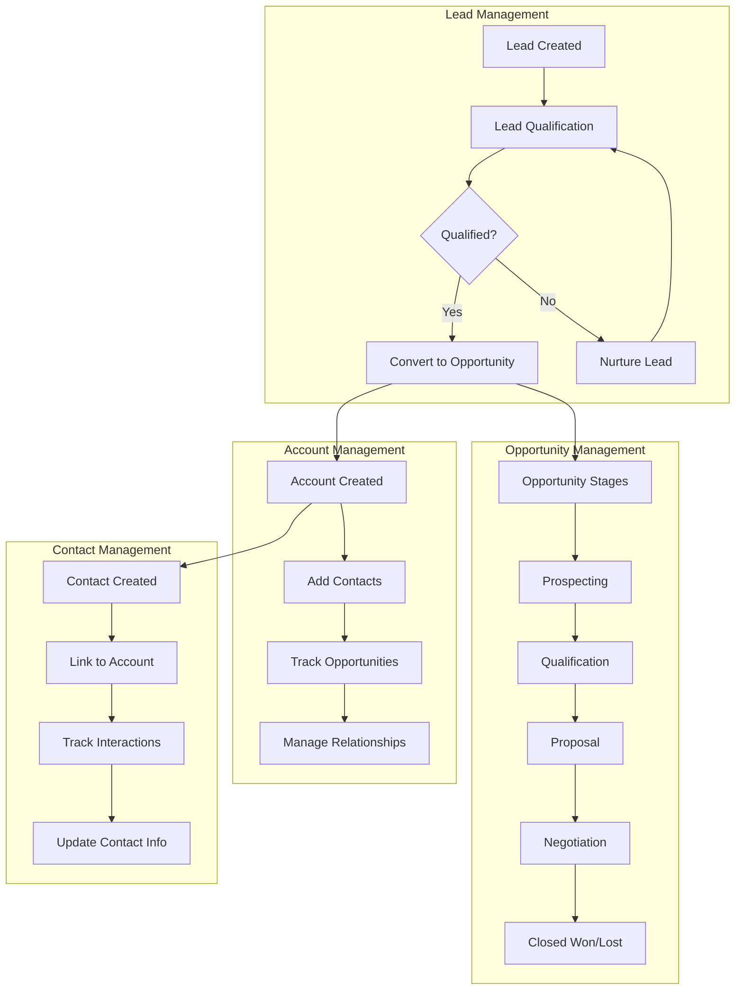

## 🔐 Permission Check Flow

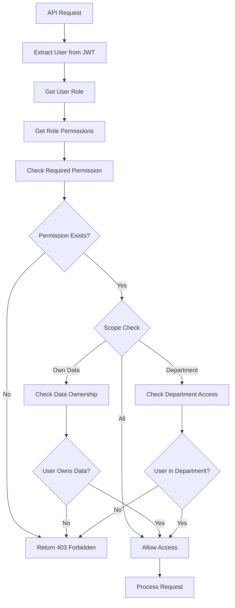

## 📝 Activity Logging Flow

```mermaid
sequenceDiagram
    participant User as User Action
    participant API as API Endpoint
    participant Service as Service Layer
    participant Activity as Activity Logger
    participant DB as Database

    User->>API: Create/Update/Delete Entity
    API->>Service: Call Service Method
    Service->>DB: Perform Operation
    DB->>Service: Operation Result
    Service->>Activity: Log Activity
    Activity->>DB: Save Activity Log
    Service->>API: Return Result
    API->>User: Response
    
    Note over Activity: Activity includes:
    - User ID
    - Action Type
    - Entity Type
    - Entity ID
    - Timestamp
    - Changes Made
```

## 📧 Email Notification Flow

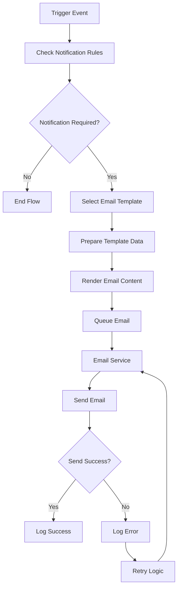

## 📁 File Upload Flow

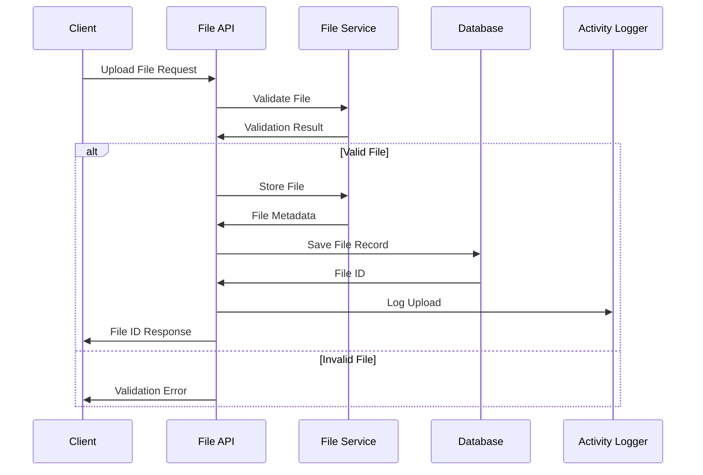

## 📊 Dashboard Data Flow

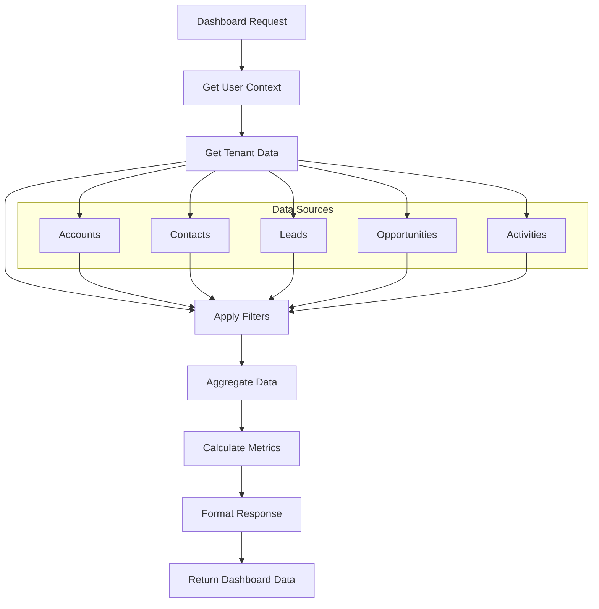

## 🔄 Background Task Flow

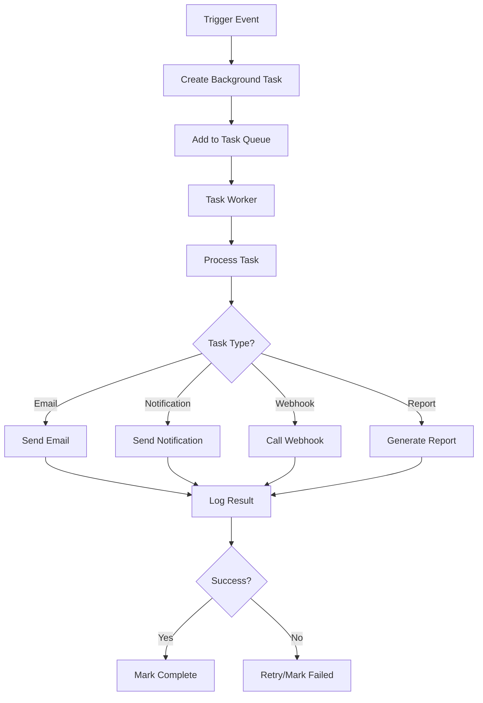

## 🔍 Search and Filter Flow

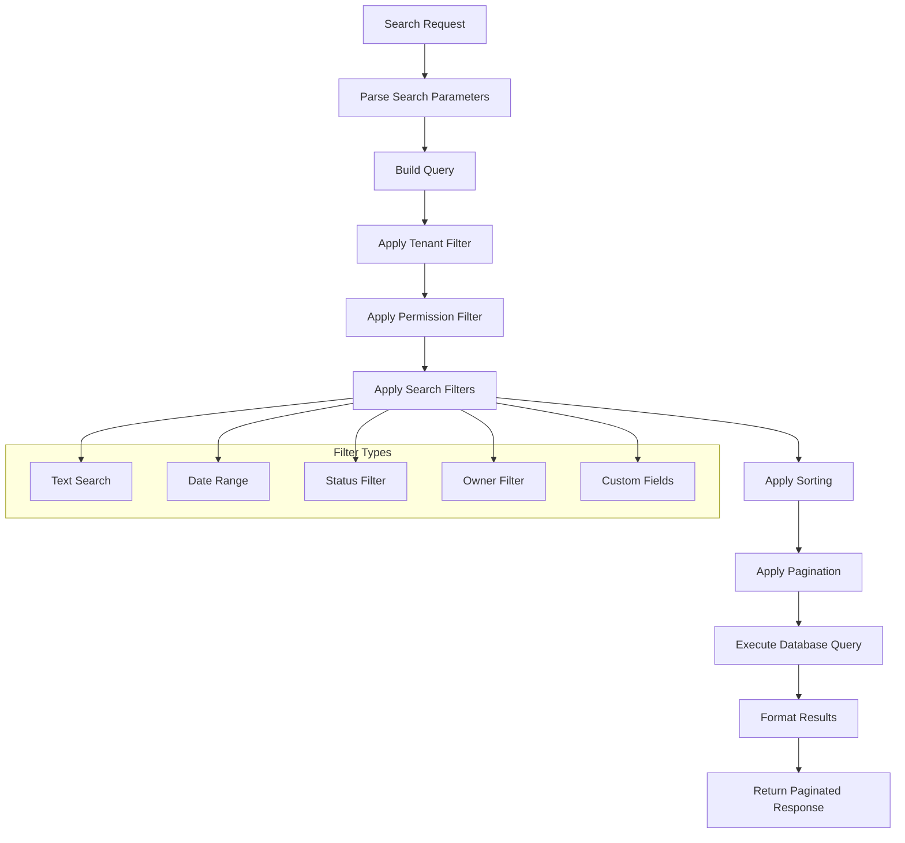

## 🚀 Error Handling Flow

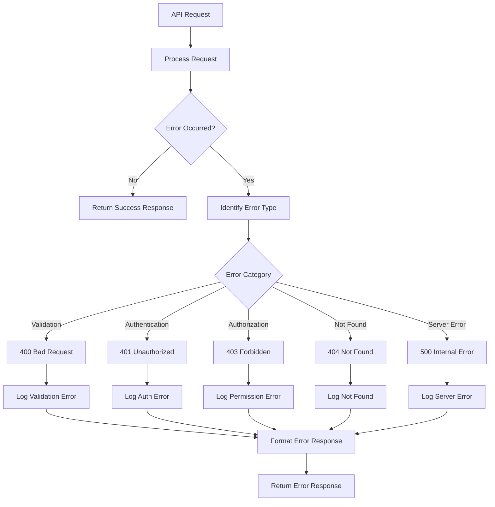

## 📈 Performance Monitoring Flow

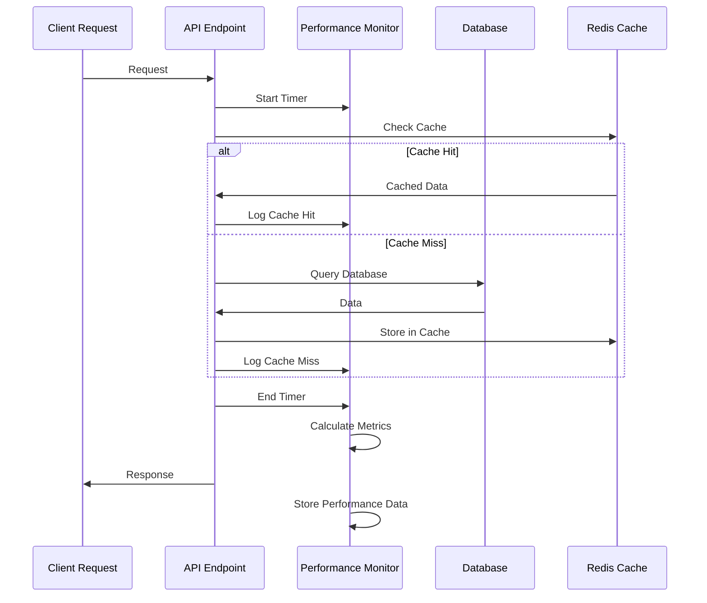

---

## 📋 Summary

These flow diagrams illustrate the complete request lifecycle in the Tutterfly CRM system, showing how different components interact to provide a secure, scalable, and efficient CRM solution. The diagrams cover authentication, authorization, data flow, error handling, and various business processes that make up the comprehensive CRM functionality.
