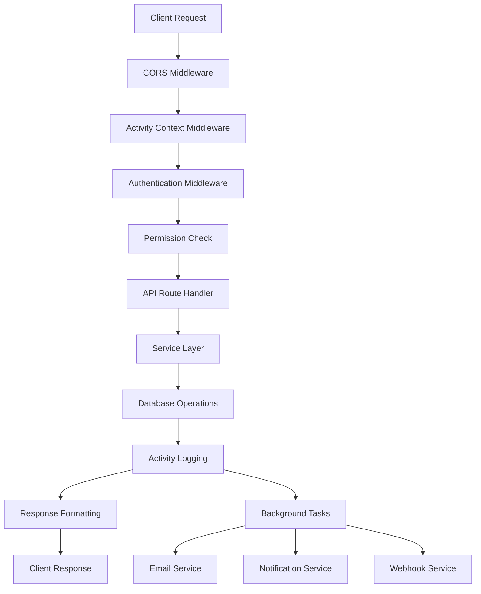
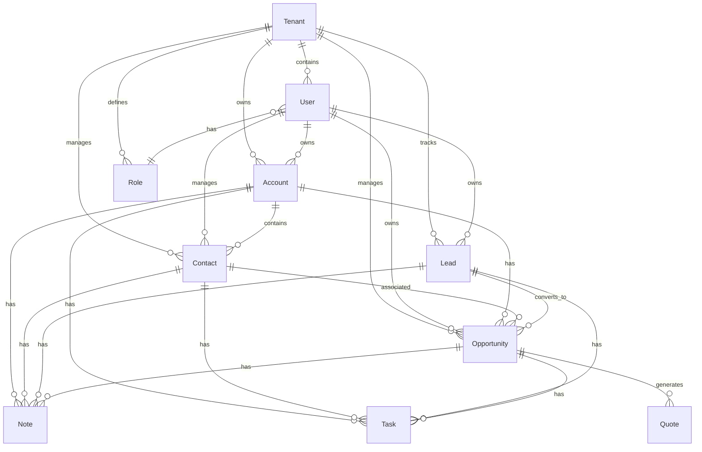

# Tutterfly CRM - Backend Architecture Documentation

## 📋 Table of Contents
1. [Overview](#overview)
2. [Architecture Principles](#architecture-principles)
3. [Technology Stack](#technology-stack)
4. [Project Structure](#project-structure)
5. [Core Components](#core-components)
6. [API Architecture](#api-architecture)
7. [Database Architecture](#database-architecture)
8. [Authentication & Authorization](#authentication--authorization)
9. [Service Layer Architecture](#service-layer-architecture)
10. [Middleware Architecture](#middleware-architecture)
11. [API Flow Diagram](#api-flow-diagram)
12. [Entity Relationships](#entity-relationships)
13. [Key Design Patterns](#key-design-patterns)
14. [Security Architecture](#security-architecture)

## 🎯 Overview

Tutterfly CRM is a comprehensive Customer Relationship Management system built with FastAPI and MongoDB. It follows a multi-tenant architecture with role-based access control, supporting various business entities like accounts, contacts, leads, opportunities, and more.

### Key Features
- **Multi-tenant Architecture**: Complete data isolation between tenants
- **Role-based Access Control (RBAC)**: Granular permissions system
- **Activity Logging**: Comprehensive audit trail
- **Real-time Notifications**: Event-driven notifications
- **Reporting & Analytics**: Dashboards and reports
- **File Management**: Document attachments and storage
- **Email Integration**: Template-based email system
- **Webhook Support**: External system integrations

## 🏗️ Architecture Principles

### 1. **Separation of Concerns**
- **API Layer**: Handles HTTP requests/responses
- **Service Layer**: Business logic implementation
- **Data Layer**: Database operations and models
- **Schema Layer**: Data validation and serialization

### 2. **Multi-tenancy**
- **Tenant Isolation**: Each tenant has completely isolated data
- **Shared Infrastructure**: Single application instance serves all tenants
- **Scalability**: Easy to scale horizontally

### 3. **Security First**
- **JWT Authentication**: Token-based authentication
- **Permission-based Authorization**: Granular access control
- **Input Validation**: Comprehensive request validation
- **SQL Injection Prevention**: ORM-based database access

## 🛠️ Technology Stack

### Core Framework
- **FastAPI**: Modern, fast web framework for building APIs
- **Python 3.11+**: Programming language
- **Pydantic**: Data validation and settings management

### Database & ORM
- **MongoDB**: NoSQL document database
- **Beanie**: MongoDB ODM for Python (async)
- **Pydantic ObjectId**: MongoDB ObjectId handling

### Authentication & Security
- **JWT (JSON Web Tokens)**: Stateless authentication
- **OAuth2**: Authentication framework
- **bcrypt**: Password hashing
- **python-jose**: JWT token handling

### Additional Libraries
- **python-multipart**: File upload handling
- **python-dotenv**: Environment variable management
- **uvicorn**: ASGI server
- **redis**: Caching and session management

## 📁 Project Structure

```
tutterfly-python/
├── app/
│   ├── api/                    # API endpoints
│   │   ├── deps.py            # Dependencies (auth, etc.)
│   │   └── v1/                # API version 1
│   │       ├── accounts.py    # Account management
│   │       ├── auth.py        # Authentication
│   │       ├── contacts.py    # Contact management
│   │       ├── leads.py       # Lead management
│   │       ├── opportunities.py # Opportunity management
│   │       ├── users.py       # User management
│   │       └── ...            # Other modules
│   ├── core/                  # Core configuration
│   │   └── config.py          # Application settings
│   ├── db/                    # Database setup
│   │   └── mongodb.py         # MongoDB connection
│   ├── middleware/            # Custom middleware
│   │   └── activity_context.py # Activity logging
│   ├── models/                # Database models
│   │   ├── base.py            # Base model classes
│   │   ├── user.py            # User model
│   │   ├── account.py         # Account model
│   │   ├── contact.py         # Contact model
│   │   └── ...                # Other models
│   ├── schemas/               # Pydantic schemas
│   │   ├── auth.py            # Auth schemas
│   │   ├── user.py            # User schemas
│   │   └── ...                # Other schemas
│   ├── services/              # Business logic
│   │   ├── auth_service.py    # Authentication service
│   │   ├── user_service.py    # User service
│   │   └── ...                # Other services
│   ├── tasks/                 # Background tasks
│   └── main.py                # FastAPI application entry
├── requirements.txt           # Python dependencies
├── .env.example              # Environment variables template
└── README.md                 # Project documentation
```

## 🧩 Core Components

### 1. **API Layer** (`app/api/`)
Handles HTTP requests and responses. Each module represents a business domain.

**Key Responsibilities:**
- Request validation
- Response formatting
- Error handling
- Authentication/authorization checks

### 2. **Service Layer** (`app/services/`)
Contains business logic and orchestrates data operations.

**Key Responsibilities:**
- Business rule implementation
- Data transformation
- Cross-entity operations
- External service integrations

### 3. **Data Layer** (`app/models/`)
MongoDB document models using Beanie ODM.

**Key Responsibilities:**
- Database schema definition
- Data validation
- Relationship management
- Query operations

### 4. **Schema Layer** (`app/schemas/`)
Pydantic models for request/response validation.

**Key Responsibilities:**
- Input validation
- Response serialization
- API documentation generation
- Type safety

## 🌐 API Architecture

### RESTful API Design
The API follows REST principles with resource-based URLs:

```
GET    /api/v1/accounts          # List accounts
POST   /api/v1/accounts          # Create account
GET    /api/v1/accounts/{id}     # Get account
PUT    /api/v1/accounts/{id}     # Update account
DELETE /api/v1/accounts/{id}     # Delete account
```

### API Modules

#### **Authentication** (`/api/v1/auth`)
- User registration and login
- JWT token management
- Password reset functionality

#### **Core CRM Entities**
- **Accounts** (`/api/v1/accounts`): Company/organization management
- **Contacts** (`/api/v1/contacts`): Individual contact management
- **Leads** (`/api/v1/leads`): Lead tracking and conversion
- **Opportunities** (`/api/v1/opportunities`): Sales opportunity management

#### **Supporting Modules**
- **Users** (`/api/v1/users`): User management
- **Roles** (`/api/v1/roles`): Role and permission management
- **Tasks** (`/api/v1/tasks`): Task management
- **Notes** (`/api/v1/notes`): Note-taking system
- **Files** (`/api/v1/files`): File upload and management
- **Emails** (`/api/v1/emails`): Email communication
- **Reports** (`/api/v1/reports`): Reporting system
- **Dashboards** (`/api/v1/dashboards`): Analytics dashboards

## 🗄️ Database Architecture

### MongoDB Document Structure

#### **Base Model** (`BaseDocument`)
All models inherit from `BaseDocument` providing:
- `created_at`: Document creation timestamp
- `updated_at`: Last modification timestamp
- `deleted_at`: Soft delete support
- Soft delete methods

#### **Tenant Isolation** (`TenantMixin`)
Multi-tenancy through `tenant_id` field:
- Complete data isolation
- Automatic tenant filtering
- Security by design

#### **Key Models**

```python
# User Model
class User(BaseDocument, TenantMixin):
    name: str
    email: str
    password_hash: str
    role_id: PydanticObjectId
    is_active: bool = True

# Account Model
class Account(BaseDocument, TenantMixin):
    name: str
    description: Optional[str]
    industry: Optional[str]
    website: Optional[str]
    owner_id: PydanticObjectId  # User who owns this account

# Contact Model
class Contact(BaseDocument, TenantMixin):
    first_name: str
    last_name: str
    email: Optional[str]
    phone: Optional[str]
    account_id: Optional[PydanticObjectId]
    owner_id: PydanticObjectId
```

### Database Indexes
Strategic indexes for performance:
- `tenant_id`: All tenant-specific queries
- `email`: User authentication
- `owner_id`: User-specific data
- Composite indexes for complex queries

## 🔐 Authentication & Authorization

### JWT-based Authentication
1. **Login**: User credentials validated, JWT token issued
2. **Token Validation**: Each request validates JWT token
3. **User Context**: Current user attached to request context

### Role-based Access Control (RBAC)
```python
class Role(BaseDocument, TenantMixin):
    name: str
    permissions: List[str]  # Permission identifiers
    is_system_role: bool = False

class Permission:
    # Examples: "accounts.create", "contacts.read", "opportunities.delete"
    module: str    # accounts, contacts, leads, etc.
    action: str    # create, read, update, delete
    scope: str     # own, all, department, etc.
```

### Permission System
- **Granular Permissions**: Module + action + scope
- **Role Assignment**: Users assigned to roles
- **Permission Inheritance**: Roles inherit permissions
- **Custom Permissions**: Tenant-specific permissions

## 🏢 Service Layer Architecture

### Service Pattern
Each service follows a consistent pattern:

```python
class EntityService:
    def __init__(self):
        # Initialize dependencies
    
    async def create(self, data: EntityCreate, user_id: str, tenant_id: str):
        # Business logic for creation
        # Validation
        # Database operations
        # Activity logging
        # Notifications
    
    async def get_by_id(self, id: str, user_id: str, tenant_id: str):
        # Permission checks
        # Data retrieval
        # Response formatting
    
    async def update(self, id: str, data: EntityUpdate, user_id: str, tenant_id: str):
        # Permission checks
        # Business validation
        # Database operations
        # Activity logging
    
    async def delete(self, id: str, user_id: str, tenant_id: str):
        # Permission checks
        # Soft delete
        # Activity logging
```

### Key Services

#### **AuthService**
- User registration and login
- Password management
- Token generation and validation
- Email verification

#### **UserService**
- User profile management
- Role assignment
- Permission checking
- User preferences

#### **ActivityLogService**
- Comprehensive activity tracking
- Audit trail maintenance
- Search and filtering
- Export capabilities

## 🛡️ Middleware Architecture

### Activity Context Middleware
```python
class ActivityContextMiddleware:
    async def __call__(self, request: Request, call_next):
        # Extract user context
        # Set up activity logging
        # Process request
        # Log activity
        # Return response
```

### CORS Middleware
- Cross-origin resource sharing configuration
- Development vs production settings
- Security headers

### Authentication Middleware
- JWT token validation
- User context injection
- Permission pre-checks

## 🔄 API Flow Diagram



## 🔗 Entity Relationships

### Core Entity Relationships



### Relationship Types

#### **One-to-Many**
- Tenant → Users, Accounts, Contacts, Leads, Opportunities
- User → Accounts, Contacts, Leads, Opportunities (owned)
- Account → Contacts, Opportunities, Notes, Tasks

#### **Many-to-Many**
- Users ↔ Roles (through assignments)
- Entities ↔ Tags (through tag associations)
- Entities ↔ Files (through attachments)

#### **Hierarchical**
- Users → Departments (organizational structure)
- Territories → Users (sales territories)

## 🎨 Key Design Patterns

### 1. **Repository Pattern**
Service layer abstracts database operations:
```python
class AccountService:
    async def create(self, data: AccountCreate):
        account = Account(**data.dict())
        await account.save()
        return account
```

### 2. **Factory Pattern**
Entity creation with validation:
```python
class LeadFactory:
    @staticmethod
    def create_lead(data: LeadCreate, user_id: str, tenant_id: str):
        return Lead(
            **data.dict(),
            owner_id=user_id,
            tenant_id=tenant_id
        )
```

### 3. **Observer Pattern**
Activity logging and notifications:
```python
class ActivityObserver:
    async def on_entity_created(self, entity):
        await self.log_activity("create", entity)
        await self.send_notifications("create", entity)
```

### 4. **Strategy Pattern**
Different authentication strategies:
```python
class AuthStrategy:
    def authenticate(self, credentials): pass

class JWTAuthStrategy(AuthStrategy):
    def authenticate(self, credentials): 
        # JWT authentication logic
```

## 🔒 Security Architecture

### Multi-layered Security

#### **1. Authentication Layer**
- JWT tokens with expiration
- Refresh token mechanism
- Password strength requirements
- Account lockout after failed attempts

#### **2. Authorization Layer**
- Role-based access control
- Permission-based operations
- Resource-level security
- Data ownership validation

#### **3. Data Security**
- Tenant isolation
- Input validation and sanitization
- SQL injection prevention (through ORM)
- XSS protection

#### **4. Infrastructure Security**
- HTTPS enforcement
- CORS configuration
- Rate limiting
- Security headers

### Security Best Practices

#### **Input Validation**
```python
class AccountCreate(BaseModel):
    name: str = Field(..., min_length=1, max_length=100)
    email: EmailStr
    website: Optional[HttpUrl] = None
```

#### **Permission Checks**
```python
async def check_permission(user: User, resource: str, action: str):
    if not await user.has_permission(f"{resource}.{action}"):
        raise HTTPException(status_code=403, detail="Insufficient permissions")
```

#### **Tenant Isolation**
```python
async def get_user_accounts(user_id: str, tenant_id: str):
    return await Account.find(
        Account.owner_id == user_id,
        Account.tenant_id == tenant_id
    ).to_list()
```

## 📊 Monitoring & Logging

### Activity Logging
Every significant action is logged:
- User actions
- Data changes
- System events
- Security events

### Error Handling
Structured error responses:
```python
{
    "error": True,
    "message": "Validation error",
    "details": {
        "field": "email",
        "error": "Invalid email format"
    }
}
```

### Health Checks
- Database connectivity
- External service status
- System metrics

## 🚀 Performance Optimizations

### Database Optimizations
- Strategic indexing
- Query optimization
- Connection pooling
- Caching strategies

### API Optimizations
- Pagination
- Field selection
- Batch operations
- Async processing

### Caching Strategy
- Redis for session storage
- Application-level caching
- Database query caching
- CDN for static assets

## 🔄 Future Enhancements

### Scalability
- Microservices architecture
- Event-driven architecture
- Message queues
- Load balancing

### Features
- Real-time collaboration
- Advanced analytics
- AI-powered insights
- Mobile API optimization

### Integration
- Third-party CRM integration
- Email service providers
- Payment gateways
- Social media platforms

---

## 📝 Conclusion

Tutterfly CRM's architecture is designed for scalability, security, and maintainability. The multi-tenant design allows serving multiple organizations from a single instance while maintaining complete data isolation. The modular structure makes it easy to extend and maintain, while the comprehensive security features ensure data protection and compliance.

The system follows modern software development practices and can be easily deployed to cloud platforms or on-premises infrastructure. The RESTful API design makes it accessible to various client applications, including web, mobile, and third-party integrations.
